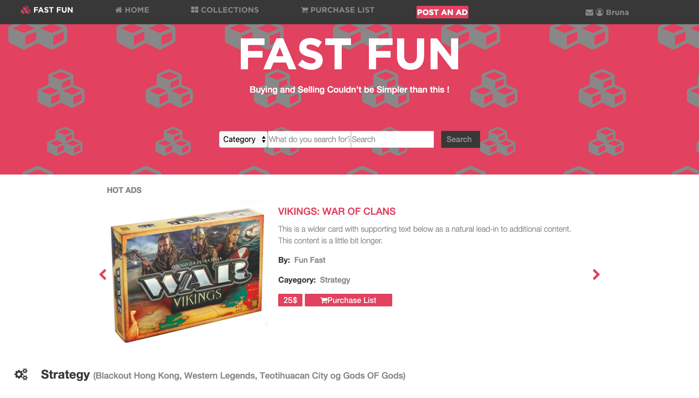

# Capstone Project: Online-shop

This project is about building a webpage based on an online shop for electronics using HTML and CSS. Design idea by Mohammed Awad on Behance and you can check out on this link (https://www.behance.net/gallery/24796463/ZATTIX). Based on the mentioned template I decided to customize it and build a board game store. There are two pages: the main one and the search result one, each of them has versions for 2 different screen sizes: 

- mobile: up to 768px
- tablet & desktop: from 768px

## desktop version (main page and search page)

## mobile version (main page and search page)

## Built With

- HTML5 & CSS4,
- bootstrap 4,
- VS Code

## Live Demo

[Live Demo Link](https://raw.githack.com/brugobi/online-shop/shop-feature/index.html)

## Getting Started

To get a local copy up and running follow these simple example steps.

- From the repository, click + in the global sidebar and select Clone this repository under Get to work.
- Copy the clone command (either the SSH format or the HTTPS). ...
- From a terminal window, change to the local directory where you want to clone your repository.

## Usage

- Any Brownser

## Author

👤 **Bruna Gobi**

- Github: [@brugobi](https://github.com/brugobi)
- Twitter: [@BrunaGobi2](https://twitter.com/BrunaGobi2)
- Linkedin: [linkedin](https://www.linkedin.com/in/bruna-gobi-08854760/)

## 🤝 Contributing

Contributions, issues and feature requests are welcome!

Feel free to check the [issues page](issues/).

## Show your support

Give a ⭐️ if you like this project!

## Acknowledgments

- Hat tip to anyone whose code was used
- Inspiration
- Microverse

## 📝 License

This project is [MIT](lic.url) licensed.
